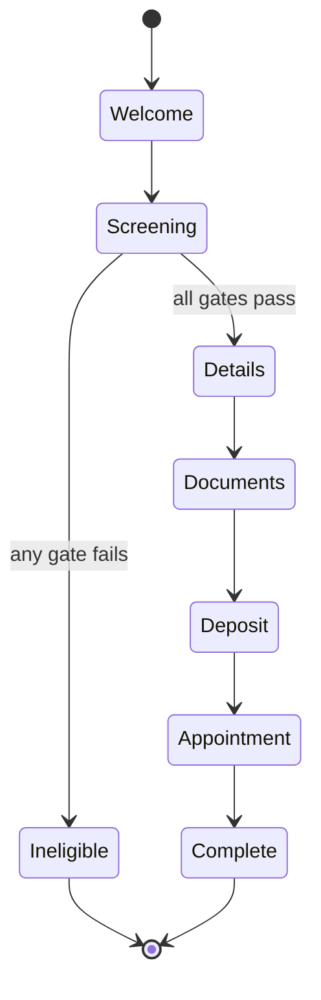

# Rider onboarding flow — design sketch

Not built yet. This is the shape to agree on first.

## The one principle

**Code decides, the model only phrases.**

The model never decides which question comes next, never decides whether a field
is valid, and never decides whether onboarding is complete. Those are a checklist
and a set of rules — exact, testable, free. Ask an LLM "have I got everything?"
and one day it will say yes with two fields blank, confidently, in fluent Roman
Urdu.

The model does exactly two jobs:

1. **Read** a rider's messy reply and pull out a value (JSON Schema mode).
2. **Speak** — answer an FAQ question mid-flow, grounded in `knowledge.ts`.

Most turns need neither. The next question is canned Roman Urdu text, so the
common path costs no tokens and no latency at all.

## Screen before you collect

Ask the disqualifying questions **first**, before any document upload or payment.
Five facts decide whether someone can do this job at all. A rider who cannot
should learn that in two minutes, not after photographing their CNIC.



## Fields

### 1. Screening — gates, ask first

| Field | Rule | If it fails |
| --- | --- | --- |
| `age_18_plus` | must be true | stop, explain 18+ requirement |
| `owns_motorbike` | must be true | stop, own bike is required |
| `smartphone_ok` | iOS ≥ 9.0 or Android ≥ 7.0 | stop, smartphone is essential |
| `has_cnic` | must be true | stop |
| `has_license` | learner's or full | stop |

Stopping is not a rejection. Record the reason and keep the session
re-contactable — someone who turns 18, or buys a bike, becomes eligible without
having to start over. Nothing is ever hard-closed.

### 2. Details

| Field | Validation |
| --- | --- |
| `full_name` | as printed on CNIC, non-empty, letters/spaces |
| `cnic_number` | 13 digits, checksum-free but format-checked |
| `phone` | Pakistani mobile format |
| `branch` | one of: F8 Markaz, Rawalpindi |

### 3. Documents — upload, OCR, then compare in code

| Document | Checked against |
| --- | --- |
| `profile_photo` | is a face, not a screenshot |
| `cnic` | OCR name + number **must match** what the rider typed |
| `license` | type is learner's or full; not expired |
| `utility_bill` | recent; address present |

**No LLM touches verification.** Documents go to a dedicated OCR API; selfie and
face match go to the dedicated face APIs. Code compares the results. The model is
only asked to phrase the outcome:
*"CNIC ka number aap ke likhay huay number se match nahi kar raha."*

The one genuinely fuzzy comparison is the **name**. Urdu names transliterate
inconsistently — Muhammad / Mohammad / Mohd, Rehman / Rahman, extra or missing
middle names. That is a normalised fuzzy string match in code (case-fold, strip
punctuation, token-set ratio with a tuned threshold), not a judgement call and
not an LLM. Everything else is exact: CNIC is 13 digits, licence type is one of
two values, the bill has a date.

### 4. Deposit and appointment

| Field | Notes |
| --- | --- |
| `deposit_paid` | Rs. 2,500 via easypaisa / JazzCash / HBL Konnect |
| `deposit_proof` | screenshot → OCR → amount, date and reference checked in code |
| `appointment` | no booking. Tell the rider the window: Mon–Fri, 12 PM–6 PM |

## What happens on each rider message

```
1. Is there a pending question?
2. Classify the message in ONE small model call (JSON Schema):
      { intent: "answer" | "question" | "other", value: string | null }
3. intent = answer   -> validate in CODE
                          pass -> save, advance, send the next canned question
                          fail -> re-ask with a specific hint (attempt 3 -> human)
   intent = question -> answer from knowledge.ts, then repeat the pending question
   intent = other    -> canned guard-rail line, then repeat the pending question
```

One small call per turn. Deterministic state. Every validation rule is unit
testable without touching the model.

## Storage — the part that needs real care

The bot is stateless today; the browser holds everything. This flow breaks that.

```
rider_session(id, phone, state, created_at, updated_at, ineligible_reason)
rider_field(session_id, key, value, verified_at)
rider_document(session_id, kind, object_key, ocr_json, status, checked_at)
```

You will be holding CNIC numbers, licences and utility bills — precisely the set
identity theft is built from, belonging to people with little recourse if it
leaks. That means, before the first real rider:

- encryption at rest, and private object storage with signed short-lived URLs
- access control and an audit trail on who reads a document
- a retention policy — what is deleted once onboarding completes, and when
- never log field values or OCR output
- the existing rule stays absolute: never ask for a PIN, password or OTP

## Decisions (settled 2026-08-22)

1. **Security deposit is Rs. 2,500.** The Rs. 1,500 in the source documents list
   was wrong. Implemented and confirmed.
2. **A rider who fails a gate stays re-contactable.** Store the reason, keep the
   session open, allow a later restart from where they stopped.
3. **No human review queue.** Deposit proofs and document mismatches are handled
   in-conversation. See the caveat below — "handled by AI" still means OCR reads
   the image and code decides; the model phrases the outcome.
4. **No slot booking.** The rider is simply told the window: Mon–Fri, 12 PM–6 PM.

### Verification is not the model's job

Confirmed: gpt-oss is not used for document verification at all. OCR reads the
documents, the existing face-match APIs handle the selfie, and code decides.
This removes the vision-model question entirely — there is no second provider and
no second latency budget to plan for.

Choose OCR on real-world rider photos, not clean scans. Accuracy dies on glare,
low light, a cracked card photographed at an angle in a shop doorway. That is the
input this will actually receive.

### The branch visit is the human review step

There is no review queue, and none is needed. Every rider must appear at F8
Markaz or Rawalpindi in person, Mon–Fri 12–6, and staff see the originals there.

So automated checks do not have to be conclusive — they only have to catch
obvious problems early, while the rider is still in the chat and can retake a
photo. When OCR confidence is low or a comparison keeps failing, the flow should
stop retrying after ~3 attempts and say: bring the original document to the
branch. That is a real resolution, not a dead end, and it keeps a bad photo from
trapping someone in a loop.

### Scale, for now

Beta runs on the Groq free tier: 8,000 TPM, roughly one conversation at a time.
Fine for testing, not for launch. Moving to the Dev tier is a prerequisite for
real riders, not an optimisation.